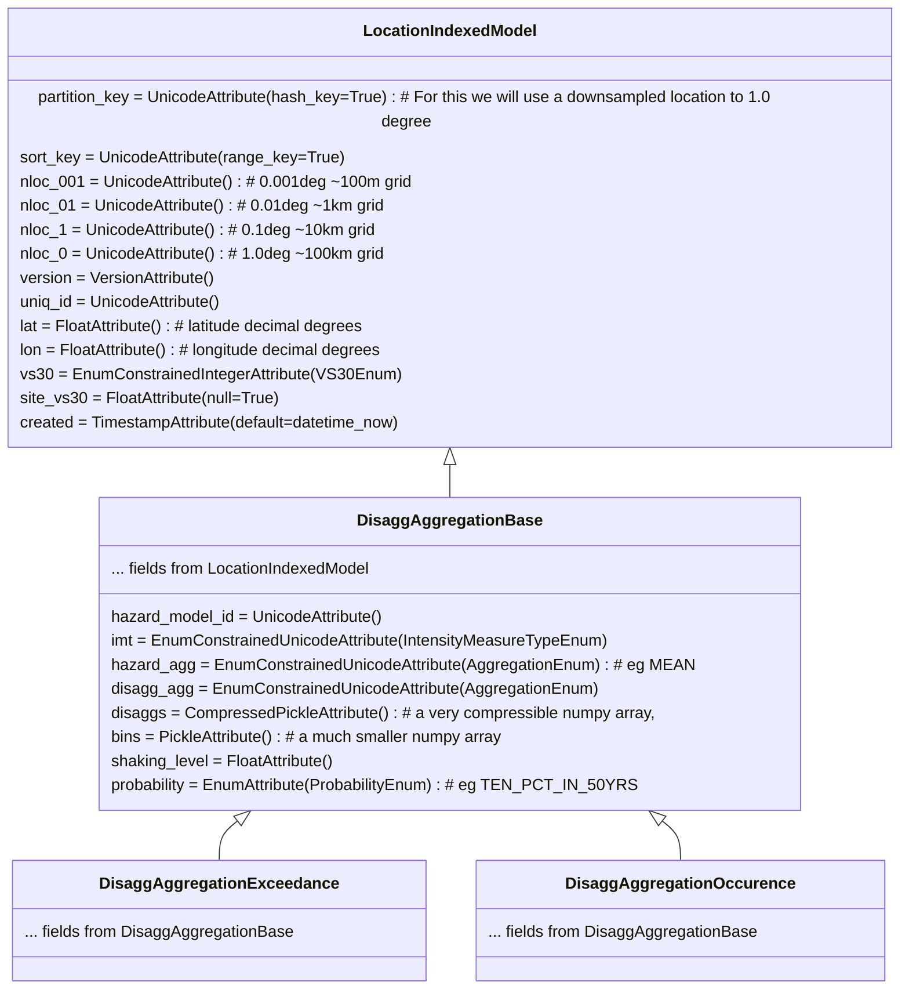

**Tables:**

 - **DisaggAggregationExceedance** - Disaggregation curves of Probablity of Exceedance
 - **DisaggAggregationOccurence** - Disaggregation curves of Probablity of Occurence

The base class **LocationIndexedModel** provides common attributes and indexing for models that support location-based indexing.

The base class **DisaggAggregationBase** defines attribtues common to both types of disaggregation curve.

