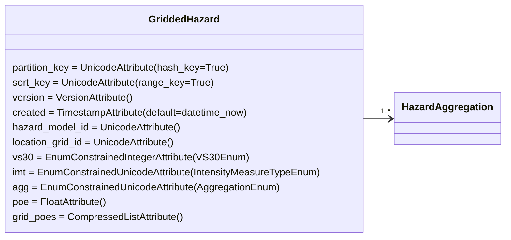

**Tables:**

 - **GriddedHazard** - Grid points defined in location_grid_id has a values in grid_poes.
 - **HazardAggregation** - stores aggregate hazard curves [see ./openquake_models for details](./openquake_models.md)

