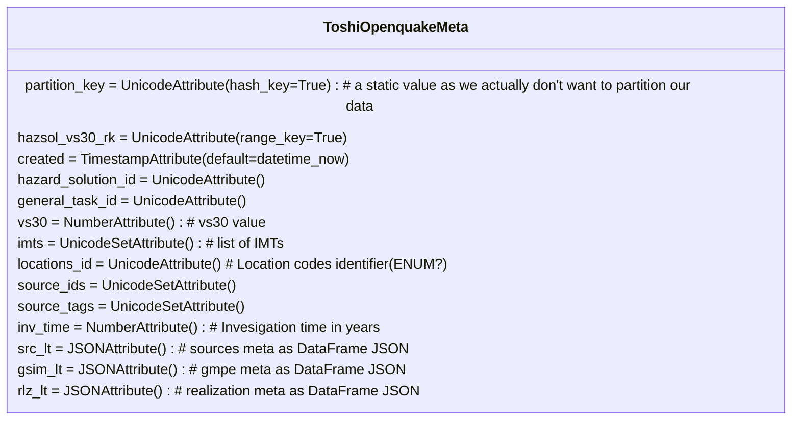
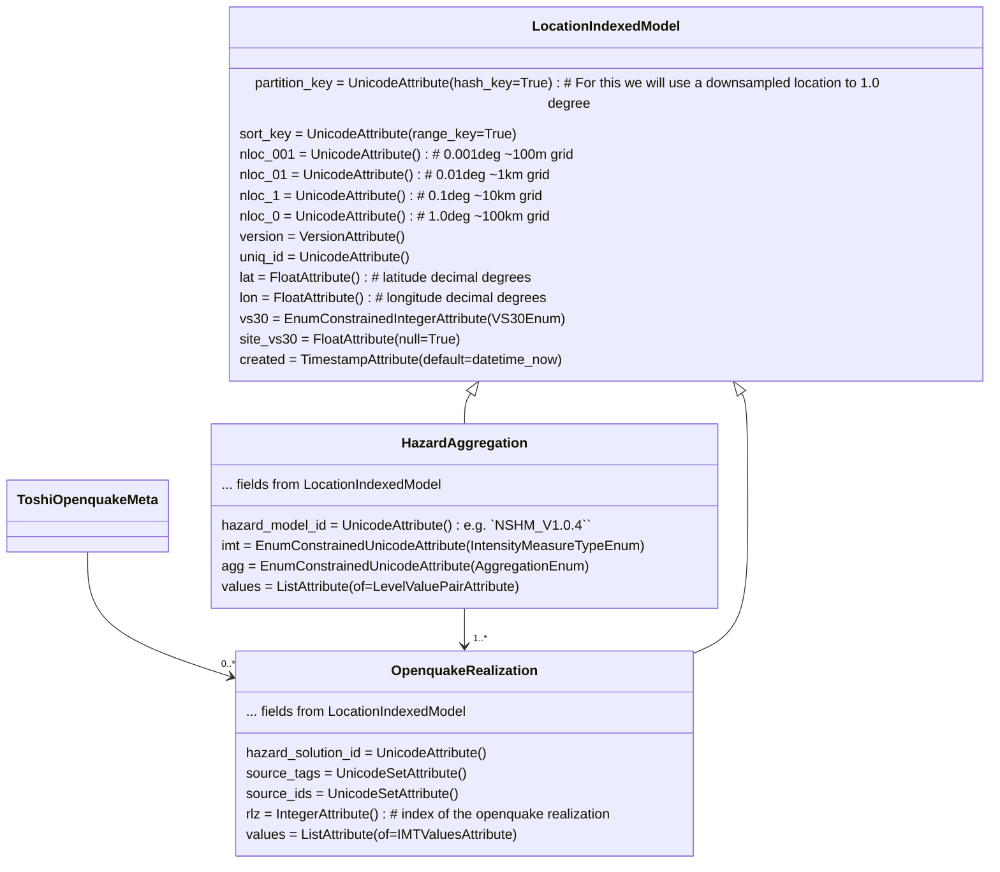

## CURRENT STATE

These table models are used to store data created by GEMs **openquake** PSHA engine. Data is extracted from the HDF5 files created by openquake and stored with relevant metadata in the following tables.

## Seismic Hazard Model diagram

**Tables:**

 - **ToshiOpenquakeMeta** - stores metadata from the job configuration and the openquake results.

**Tables:**

 - **OpenquakeRealization** -  stores the individual hazard realisation curves.
 - **HazardAggregation** - stores aggregate hazard curves from **OpenquakeRealization** curves.

The base class **LocationIndexedModel** provides common attributes and indexing for models that support location-based indexing.

