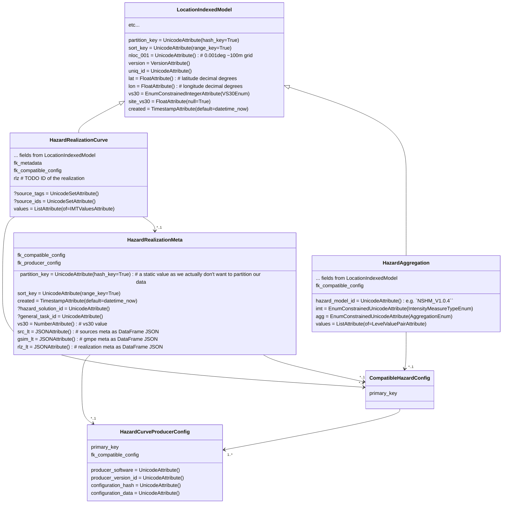

## FUTURE STATE

These table models are used to store data created by any suitable PSHA engine. 

## Seismic Hazard Model diagram

Different hazard engines, versions and/or configurations may produce compatible calcalution curves.

This model is similar to the current one, except that:

  - the concept of compatible producer configs is supported
  - **HazardRealizationCurve** records are identified solely by internal attributes & relationships. So **toshi_hazard_soluton_id** is removed but can be recorded in **HazardRealizationMeta**.

**TODO:** formalise logic tree branch identification for both source and GMM logic trees so that these are:

 -  a) unique and unambigious, and
 -  b) easily relatable  to **nzshm_model** instances.
 
**Tables:**

- **CompatibleHazardConfig (CHC)** - defines a logical identifier for compatable **HCPCs**. Model managers must ensure that compability holds true.
- **HazardCurveProducerConfig (HCPC)** - stores the unique attributes that define compatible hazard curve producers. 
- **HazardRealizationMeta** - stores metadata common to a set of hazard realization curves.
- **HazardRealizationCurve** - stores the individual hazard realisation curves.
 - **HazardAggregation** - stores the aggregated hazard curves [see ./openquake_models for details](./openquake_models.md)

